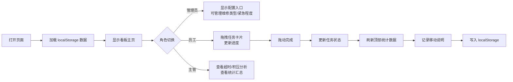

## 1. 产品概述

本产品是一个面向物业公司的维修任务看板管理工具，支持多角色协同工作，实现维修任务的全流程可视化管理。通过拖拽式看板交互，结合实时数据统计和多维度筛选，帮助物业团队高效分配、跟踪和完成维修任务。

- 核心目标：提升物业维修响应效率，实现任务透明化管理，降低任务积压和超时率
- 目标用户：物业管理员、维修员工、运维主管

## 2. 核心功能

### 2.1 用户角色

| 角色 | 登录方式 | 核心权限 |
|------|----------|----------|
| 管理员 | 页面内切换 | 配置维修类型、紧急程度，查看全部数据，管理任务 |
| 维修员工 | 页面内切换 | 查看和拖动任务卡，更新任务进度，处理分配的任务 |
| 主管 | 页面内切换 | 查看超时和积压情况，查看统计数据，监控整体进度 |

### 2.2 功能模块

1. **看板主页面**：顶部统计面板、筛选区域、横向六列看板布局
2. **角色切换模块**：页面顶部快速切换管理员/员工/主管三种视图
3. **任务管理模块**：任务卡片展示、拖拽流转、移动记录
4. **配置管理模块**：维修类型配置、紧急程度配置（管理员）
5. **统计分析模块**：负责人负载统计、超时任务统计、复核等待统计、紧急任务统计
6. **数据管理模块**：localStorage 持久化、数据导出、筛选功能

### 2.3 页面详情

| 页面名称 | 模块名称 | 功能描述 |
|-----------|-------------|---------------------|
| 看板主页 | 顶部统计区 | 展示负责人负载、超时数量、复核等待数、紧急任务数、最近移动记录 |
| 看板主页 | 筛选区 | 按负责人、楼栋、紧急程度、状态多维筛选 |
| 看板主页 | 看板区 | 六列横向看板：待确认、待上门、处理中、待复核、已完成、暂缓 |
| 看板主页 | 任务卡片 | 展示任务信息，支持拖拽，显示紧急程度标识和超时警告 |
| 配置弹窗 | 维修类型配置 | 新增/编辑/删除维修类型（管理员可见） |
| 配置弹窗 | 紧急程度配置 | 新增/编辑/删除紧急程度及超时阈值（管理员可见） |

## 3. 核心流程

用户打开页面后，默认以员工角色进入看板视图。可以随时切换角色以获得不同的操作权限和数据视图。员工通过拖拽任务卡片来更新任务状态，每次拖拽都会触发统计数据的实时刷新，并记录移动说明。管理员可以配置基础数据，主管可以查看超时和积压分析。

## 4. 用户界面设计

### 4.1 设计风格
- **主色调**：深蓝 (#1e3a5f) 搭配暖橙 (#ff7a45) 作为强调色，体现专业和高效
- **辅助色**：绿色 (#52c41a) 表示完成，红色 (#f5222d) 表示超时/紧急，蓝色 (#1890ff) 表示处理中
- **按钮风格**：圆角 6px，轻微阴影，hover 状态有颜色加深和上浮效果
- **字体**：系统字体栈，标题使用中等字重，正文使用常规字重
- **布局风格**：顶部固定筛选+统计区，下方横向滚动看板列，卡片式设计
- **图标风格**：使用 lucide-react 线性图标，保持简洁统一

### 4.2 页面设计概述

| 页面名称 | 模块名称 | UI 元素 |
|-----------|-------------|-------------|
| 看板主页 | 角色切换栏 | 顶部 Tab 切换，选中状态有底部指示条 |
| 看板主页 | 统计卡片组 | 四个圆角卡片，带图标和数值，hover 有微动效 |
| 看板主页 | 筛选栏 | 下拉选择器组合，紧凑布局，清晰的标签 |
| 看板主页 | 看板列 | 竖向排列的列，带列标题和任务计数，有轻微背景区分 |
| 看板主页 | 任务卡片 | 白色卡片，阴影，紧急程度色条，拖拽时半透明 |
| 配置弹窗 | 配置表单 | 模态弹窗，表单输入，列表管理 |

### 4.3 响应式
- 桌面端优先设计，看板列横向排列
- 中等屏幕：保持横向布局，适当缩小卡片尺寸
- 移动端：看板列改为可横向滚动，统计卡片自适应换行
- 触摸优化：增大拖拽热区，提供触摸反馈

### 4.4 动效设计
- 页面加载：统计卡片和看板列依次淡入，带轻微位移
- 拖拽过程：卡片半透明，目标列高亮提示
- 状态变化：数字变动时有计数动画
- 悬停效果：卡片轻微上浮，阴影加深
