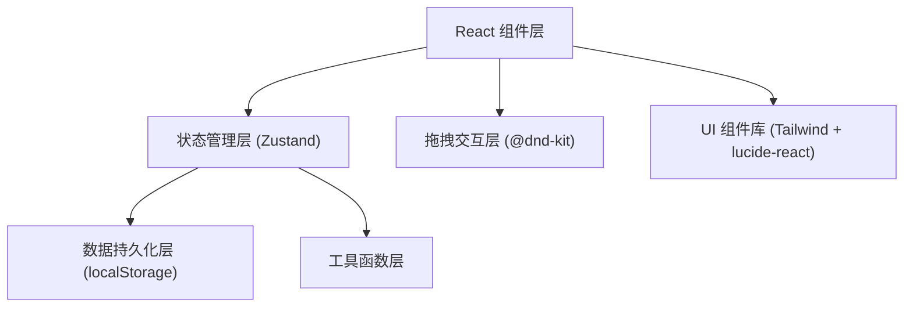
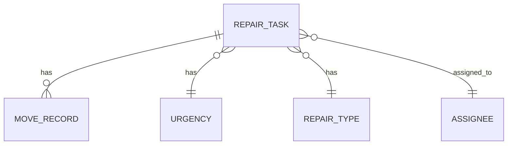

## 1. 架构设计

本项目为纯前端单页应用，无需后端服务，所有数据通过浏览器 localStorage 持久化存储。采用分层架构设计，确保关注点分离和代码可维护性。



## 2. 技术描述

- **前端框架**: React@18 + TypeScript
- **构建工具**: Vite
- **样式方案**: TailwindCSS@3
- **状态管理**: Zustand
- **拖拽库**: @dnd-kit/core + @dnd-kit/sortable + @dnd-kit/utilities
- **图标库**: lucide-react
- **数据存储**: localStorage（浏览器本地存储）
- **初始化工具**: vite-init (react-ts 模板)

## 3. 路由定义

本项目为单页面应用，使用 react-router-dom 管理路由：

| 路由 | 用途 |
|-------|---------|
| / | 看板主页面（包含所有功能模块） |

## 4. 核心类型定义

```typescript
// 任务状态
type TaskStatus = 'pending' | 'to_visit' | 'processing' | 'to_review' | 'completed' | 'deferred';

// 紧急程度
interface Urgency {
  id: string;
  name: string;
  color: string;
  timeoutHours: number; // 超时阈值（小时）
}

// 维修类型
interface RepairType {
  id: string;
  name: string;
  icon: string;
}

// 负责人
interface Assignee {
  id: string;
  name: string;
  avatar?: string;
}

// 移动记录
interface MoveRecord {
  id: string;
  taskId: string;
  fromStatus: TaskStatus;
  toStatus: TaskStatus;
  movedAt: number;
  note: string;
}

// 维修任务
interface RepairTask {
  id: string;
  title: string;
  description: string;
  typeId: string;
  urgencyId: string;
  assigneeId: string;
  building: string;
  room: string;
  status: TaskStatus;
  createdAt: number;
  updatedAt: number;
  contactName: string;
  contactPhone: string;
}

// 筛选条件
interface FilterOptions {
  assigneeId: string | null;
  building: string | null;
  urgencyId: string | null;
  status: TaskStatus | null;
}

// 角色类型
type Role = 'admin' | 'staff' | 'supervisor';
```

## 5. 数据模型

### 5.1 实体关系图



### 5.2 数据存储结构

localStorage 中存储的数据结构：

```typescript
interface StorageData {
  tasks: RepairTask[];
  urgencies: Urgency[];
  repairTypes: RepairType[];
  assignees: Assignee[];
  moveRecords: MoveRecord[];
  filters: FilterOptions;
  currentRole: Role;
}
```

存储键名：`property_maintenance_board`

### 5.3 初始数据（种子数据）

应用首次加载时自动初始化以下默认数据：

- 紧急程度：一般（24h）、紧急（8h）、非常紧急（2h）
- 维修类型：水电维修、空调维修、门窗维修、墙面维修、管道疏通、其他
- 负责人：张三、李四、王五、赵六
- 示例任务：6-8 条覆盖各状态的示例任务

## 6. 组件结构

```
src/
├── components/
│   ├── board/
│   │   ├── KanbanBoard.tsx      # 看板主容器
│   │   ├── BoardColumn.tsx      # 单列组件
│   │   └── TaskCard.tsx         # 任务卡片
│   ├── layout/
│   │   ├── Header.tsx           # 顶部导航栏（角色切换）
│   │   └── StatsPanel.tsx       # 统计面板
│   ├── filters/
│   │   └── FilterBar.tsx        # 筛选栏
│   ├── modals/
│   │   ├── ConfigModal.tsx      # 配置弹窗
│   │   └── TaskDetailModal.tsx  # 任务详情弹窗
│   └── common/
│       ├── RoleTab.tsx          # 角色切换标签
│       ├── StatCard.tsx         # 统计卡片
│       └── ExportButton.tsx     # 导出按钮
├── hooks/
│   ├── useBoardData.ts          # 看板数据 Hook
│   ├── useDragAndDrop.ts        # 拖拽逻辑 Hook
│   └── useLocalStorage.ts       # localStorage Hook
├── store/
│   └── useTaskStore.ts          # Zustand 状态管理
├── utils/
│   ├── storage.ts               # 存储工具函数
│   ├── export.ts                # 导出工具函数
│   └── statistics.ts            # 统计计算函数
├── types/
│   └── index.ts                 # 类型定义
├── data/
│   └── seedData.ts              # 种子数据
├── App.tsx
├── main.tsx
└── index.css
```

## 7. 核心功能实现要点

### 7.1 拖拽实现
- 使用 @dnd-kit 实现跨列拖拽
- 拖拽时实时高亮目标列
- 拖拽结束后自动更新任务状态和统计数据
- 记录每次移动的来源、目标和时间

### 7.2 统计联动
- 基于 Zustand 派生状态计算统计数据
- 任务状态变化时自动重新计算
- 负责人负载：统计每人未完成任务数
- 超时判断：根据紧急程度阈值 + 创建时间计算

### 7.3 数据持久化
- Zustand 中间件实现状态自动持久化
- 页面加载时从 localStorage 恢复数据
- 初始化时如无数据则注入种子数据

### 7.4 角色控制
- 基于 currentRole 状态控制组件可见性
- 管理员：显示配置按钮，可编辑基础数据
- 员工：可拖拽任务，可查看任务详情
- 主管：显示超时/积压分析视图，数据只读
